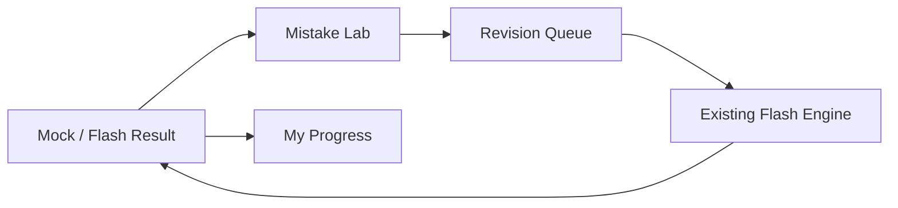

# Admission Hub — New Command Center Tools Blueprint

> **এই document শুধু blueprint।** এখন কোনো নতুন tool, card, database change বা UI add করা হবে না। তোমার approval পাওয়ার পরেই build শুরু হবে।

## 1. তিনটি নতুন tool-এর পরিচয়

আগের Progress, Mistakes Bank ও Smart Revision নামগুলো ফেরত আসবে না। একই পুরনো design বা confusing flow না রেখে তিনটি নতুন, আলাদা কাজের tool হবে। প্রতিটির data শুধু তোমার নিজের parsed question, Mock/Flash result, ভুল উত্তর এবং review activity থেকে আসবে। কোনো demo data, fake score বা AI-generated analysis থাকবে না।

| Command Center slot | নতুন নাম | এক লাইনের কাজ | Icon style |
|---|---|---|---|
| 1 | **My Progress** | পড়াশোনার আসল অগ্রগতি কোথায় বাড়ছে বা থেমে আছে তা দেখাবে | Clean upward graph |
| 2 | **Mistake Lab** | কোন ভুলগুলো আবার হওয়ার ঝুঁকিতে আছে তা practice-ready করে দেবে | Focused target / red-to-emerald mark |
| 3 | **Revision Queue** | আজকে কোন প্রশ্নগুলো revise করা দরকার, তার ছোট বাস্তব তালিকা দেবে | Minimal rotating review mark |

তিনটি card-ই একই Command Center design family-তে থাকবে: শান্ত white/mint surface, rounded card, বড় readable title, এক লাইনের real-data summary এবং extra decorative text থাকবে না।

---

## 2. Tool 1 — My Progress

### মূল উদ্দেশ্য

এটি পুরনো generic analytics page হবে না। এটি হবে একটি **exam-performance map**: “গত ৭ দিন, ৩০ দিন ও সব সময়ের result অনুযায়ী আমি কোথায় আছি?”—এই এক প্রশ্নের পরিষ্কার উত্তর।

### Dashboard card

Card-এ থাকবে তিনটি ছোট real metric: **attempted questions**, **accuracy trend**, এবং **study streak**। Trend শুধুই তখন দেখা যাবে যখন অন্তত দুইটি comparable period-এর exam data থাকবে। Data কম হলে card লিখবে: *“আর কয়েকটি exam complete হলে trend দেখা যাবে।”* কোনো কৃত্রিম percentage দেখাবে না।

### Tool page flow

| Area | কী দেখা যাবে | Interaction |
|---|---|---|
| Time selector | 7 days, 30 days, All time | এক tap-এ period বদলাবে, page reset হবে না |
| Performance strip | Questions, correct, wrong, skipped, accuracy, time | সব metric exam result থেকে হিসাব হবে |
| Subject map | Subject অনুযায়ী accuracy এবং attempts | Subject card চাপলে তার topic list খুলবে |
| Topic map | যথেষ্ট attempt আছে এমন topic-এর actual accuracy | সবচেয়ে দুর্বল/সবচেয়ে শক্তিশালী label, কিন্তু কোনো fake suggestion নয় |
| Exam comparison | সাম্প্রতিক চারটি completed exam | Score, accuracy, time side-by-side; result detail খোলা যাবে |

### গুরুত্বপূর্ণ নিয়ম

যে topic-এ খুব কম attempt আছে সেখানে “weak” label দেওয়া হবে না। উদাহরণ হিসেবে minimum 3 answered question ছাড়া topic verdict আসবে না। এতে একবার ভুল করলেই ভুলভাবে weak label হবে না।

---

## 3. Tool 2 — Mistake Lab

### মূল উদ্দেশ্য

Mistake Lab শুধু “সব ভুল প্রশ্নের dump” হবে না। এটি তোমাকে real ভুলগুলোকে তিন ভাগে সাজিয়ে practice-ready করবে: **Repeated**, **Recent**, এবং **Unresolved**।

### Dashboard card

Card-এ থাকবে: *“আজ revise করার মতো 8টি ভুল”*—শুধু বাস্তবে qualifying question থাকলে। না থাকলে: *“এখন active mistake নেই।”* Card-এর নিচে ছোট **Practice** button থাকবে; card চাপলেও একই tool খুলবে।

### Tool page flow

| Tab | Selection rule | User কী করবে |
|---|---|---|
| Repeated | একই question দুই বা তার বেশি বার ভুল | 10/20 question-এর focused Flash বা Mock practice |
| Recent | শেষ 7 দিনের ভুল | ভুলে যাওয়ার আগে দ্রুত review |
| Unresolved | আগে ভুল হয়েছিল, পরে এখনও correct হয়নি | Original question card থেকে retry |
| Reviewed | তুমি review complete করেছ | চাইলে আবার queue-তে আনতে পারবে |

### Question card design

প্রতিটি card existing game-card language বজায় রাখবে। Question, চারটি option, তোমার শেষ ভুল option **red**, correct option **green**, এবং explanation collapse করা থাকবে। “AI Explain” auto খুলবে না। নিচে শুধু তিনটি action থাকবে: **Retry now**, **Mark reviewed**, **Remove from active queue**।

### Safety rule

“Remove from active queue” মানে ভুলের record delete নয়। এটি শুধু Mistake Lab-এর active list থেকে সরবে। মূল exam history, note, result বা question bank কিছুই মুছবে না। ভুলটি আবার হলে system নিজে আবার queue-তে আনবে।

---

## 4. Tool 3 — Revision Queue

### মূল উদ্দেশ্য

এটি Mistake Lab-এর duplicate হবে না। Mistake Lab দেখায় **কেন ভুল হয়েছিল**; Revision Queue তৈরি করবে **আজকের ছোট revision order**। এটি discipline tool, full planner নয়।

### Queue তৈরির নিয়ম

Question কেবল নিচের বাস্তব কারণগুলোর ভিত্তিতে queue-তে আসবে:

| Priority | Rule | কেন আগে আসবে |
|---|---|---|
| High | দুইবার বা বেশি ভুল, অথবা last attempt wrong | পুনরায় ভুল হওয়ার ঝুঁকি বেশি |
| Medium | একবার ভুল, কিন্তু এখনও পরে correct হয়নি | ধারণা verify করা দরকার |
| Medium | অনেকদিন আগে practice করা question | স্মৃতি refresh দরকার |
| Low | Marked review question | তুমি নিজে পরে দেখতে চেয়েছিলে |

### Tool page flow

উপরে থাকবে আজকের queue count ও estimated minutes। নিচে তিনটি বড় button: **Quick 10**, **Focused 20**, **Review by Topic**। কোনো long setup wizard থাকবে না। Exam শুরু হলে existing Flash engine ব্যবহার হবে; নতুন আলাদা exam engine বানানো হবে না। শেষ হলে শুধু queue status update হবে।

### Review completion

একটি question retry-তে correct হলে সেটি *reviewed* হবে; ভুল হলে তার priority বাড়বে। এটি real attempt history সংরক্ষণ করবে, তাই future My Progress ও Mistake Lab একই সত্য data দেখবে।

---

## 5. তিনটি tool একসাথে কীভাবে কাজ করবে

নিচের flow-টাই পুরো system-এর backbone হবে।

> একই data তিনবার copy করা হবে না। Exam result হবে source of truth; Mistake Lab ও Revision Queue শুধু সেই data থেকে safe derived state রাখবে।

---

## 6. Visual design direction

| Part | Visual decision |
|---|---|
| Command cards | Existing blank slot-এর size বজায় রেখে mint/white card, large title, small truthful summary |
| My Progress | Emerald graph accent, neutral chart background, no noisy animation |
| Mistake Lab | Soft coral/red only as a priority signal; পুরো page red হবে না |
| Revision Queue | Calm blue-violet queue accent; completion-এ subtle green confirmation |
| Empty state | বড় illustration নয়; one-line honest state এবং relevant action |
| Motion | Page switch under 180ms; answer/review motion শুধু transform/opacity; reduced-motion honour করবে |

সব card মোবাইলে full width থাকবে। Icon action কখনো word/options-এর পড়ার জায়গা দখল করবে না।

---

## 7. Data, cloud sync এবং safety boundary

নতুন tool বানালে প্রয়োজন হলে শুধু একটি ছোট **revision state** store add হবে। এতে question id, priority, last reviewed time এবং completion status থাকবে। Question text, option, result বা source data duplicate করে রাখা হবে না।

বর্তমান private cloud sync-এ store যোগ হলে সেটি encrypted snapshot-এর সঙ্গে sync হবে। PWA ও normal website দুই জায়গাতেই একই revision state থাকবে। Merge conflict হলে server data দিয়ে local history overwrite হবে না; existing safe merge rule অনুযায়ী unresolved local copy থাকবে।

| বিষয় | নিরাপত্তা নিয়ম |
|---|---|
| Existing question bank | কোনো edit/delete নয় |
| Mock/Flash engine | Existing engine reuse; নতুন engine নয় |
| Existing results/history | Read-only source; delete নয় |
| Notes | অপরিবর্তিত থাকবে |
| Cloud sync | নতুন revision state automatic sync হবে |
| Empty data | Honest empty state; fake metric বা demo card নয় |

---

## 8. Build order

সব একসাথে না করে নিচের order-এ করলে risk কম হবে।

1. **Foundation:** revision state store, safe migration এবং cloud-sync inclusion।
2. **Mistake Lab:** কারণ এটিই Revision Queue-এর সবচেয়ে দরকারি source।
3. **Revision Queue:** Mistake Lab ও real history থেকে queue তৈরি।
4. **My Progress:** সব real result ও review data এক জায়গায় clean summary।
5. **QA:** 0 data, few data, large history, offline PWA, live site sync, back navigation এবং existing Mock/Flash result regression test।

## 9. তোমার approval দরকার

এই তিনটি নাম ও কাজ ঠিক থাকলে আমি প্রথমে **Mistake Lab** build করব, তারপর **Revision Queue**, শেষে **My Progress**। যদি নাম বদলাতে চাও, এখনই বদলানো সবচেয়ে সহজ; code শুরু হওয়ার পরে নয়।
